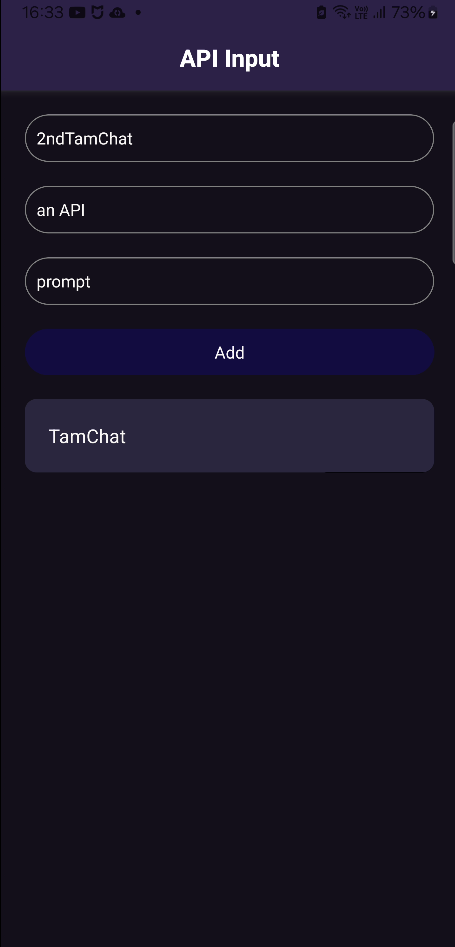
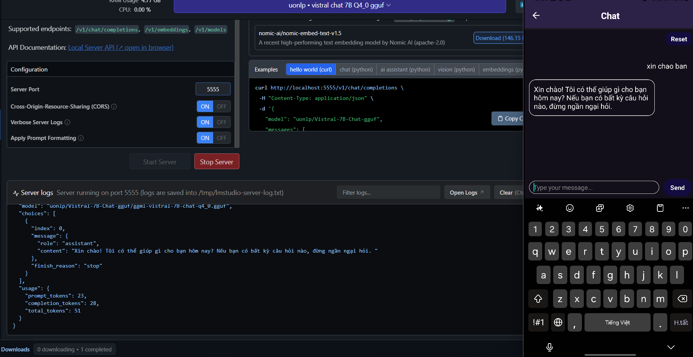
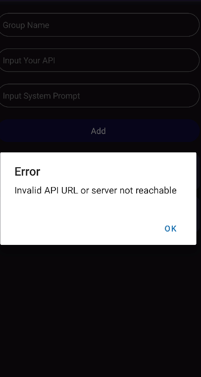

## This app is created to chat by api from LM Studio
This project is built using React Native by a student. First, enter your API key from LM Studio and add the system prompt for the model.
Here is an example:

If your added API key is not valid, you will not be able to access the chat screen.

## Download
[aab]: https://drive.google.com/file/d/1EHNx_fzrqKrCgBZp2qePliPFBymXRZ9G/view?usp=sharing
[apk]: https://drive.google.com/file/d/1TWvlpPs21_KNf__xeFdfYV2O-KkDp1vW/view?usp=sharing

If you encounter any problems, please report them to me.
email: nguyndantdm6@gmail.com
